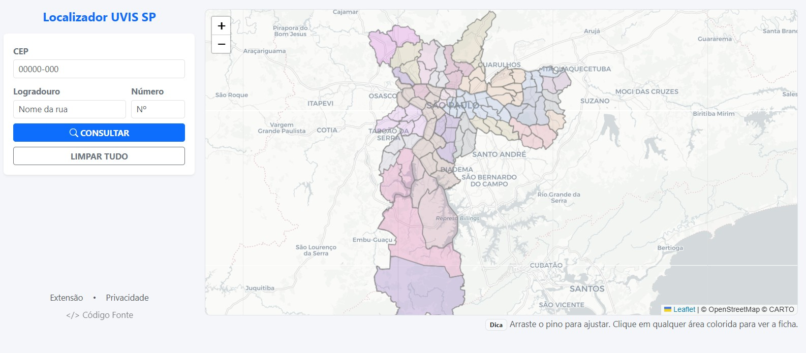
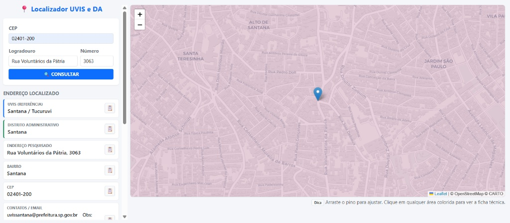
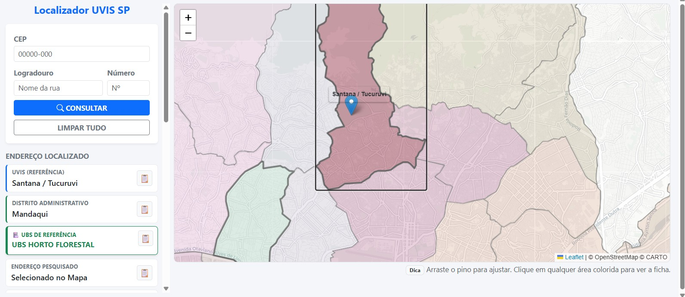

# Localizador UVIS e UBS - Cidade de São Paulo
<div class="text-center mb-4">
        <h3 class="fw-bold text-primary">Localizador UVIS e UBS</h3>
        <p class="text-muted small mb-3">Consulta de Território</p>

> **Prefere usar sem abrir o site?** [**Baixe a Extensão na Chrome Web Store ↗**](https://chromewebstore.google.com/detail/localizador-uvis-e-ubs/ohhkpccnilhbbhgeidmajpghpjgpipcc)

Ferramenta web desenvolvida para facilitar a identificação da **Unidade de Vigilância em Saúde (UVIS)**, do **Distrito Administrativo (DA)**  e da **Unidade Básica de Saúde (UBS)** correspondentes a um determinado endereço ou CEP no município de São Paulo.

**[Acesso Online Aqui](https://wellingtonlb.github.io/consulta-uvis/)**

---

## Screenshots

### 1. Interface Principal
Visão geral da ferramenta com mapa interativo e campos de busca.


### 2. Busca de Endereço
Ao digitar o CEP ou Logradouro, o sistema localiza o ponto no mapa, traça o território e exibe os dados resumidos na lateral.


### 3. Ficha Técnica Detalhada
Ao clicar sobre qualquer área colorida do mapa, uma ficha técnica completa é exibida, contendo contatos, e-mails para notificação (ex: Hepatites) e endereços das unidades de referência.


---

## Funcionalidades

* **Busca Automática por CEP:** Integração com a API ViaCEP para preenchimento automático de logradouro e bairro.
* **Geolocalização:** Utiliza a API Nominatim (OpenStreetMap) para converter endereços em coordenadas geográficas.
* **Análise Espacial (Territórios):**
    * Usa **Turf.js** para verificar matematicamente em qual polígono (região da UVIS) o endereço pesquisado se encontra.
    * Não depende apenas da proximidade, mas sim das fronteiras oficiais definidas pela prefeitura.
* **Mapa Interativo:** Visualização clara das divisões territoriais com **Leaflet.js**.
* **Copiar para Área de Transferência:** Botões rápidos para copiar endereços, e-mails e telefones.
* **Ficha Técnica Dinâmica:** Exibe informações detalhadas específicas de cada região, incluindo contatos epidemiológicos.

---

## Tecnologias Utilizadas

* **HTML5 & CSS3**
* **JavaScript (Vanilla)**
* **[Bootstrap 5](https://getbootstrap.com/)** (Interface responsiva)
* **[Leaflet.js](https://leafletjs.com/)** (Renderização do mapa)
* **[Turf.js](https://turfjs.org/)** (Análise geoespacial e verificação de polígonos)
* **APIs:** ViaCEP e Nominatim (OSM)

---

## Como Executar Localmente

1.  Clone este repositório:
    ```bash
    git clone [https://github.com/wellingtonlb/consulta-uvis.git](https://github.com/wellingtonlb/consulta-uvis.git)
    ```
2.  Navegue até a pasta do projeto.
3.  Abra o arquivo `index.html` em seu navegador de preferência.
    * *Nota: Devido a políticas de segurança de CORS de alguns navegadores, recomenda-se usar uma extensão como "Live Server" no VSCode ou rodar um servidor local simples (ex: `python -m http.server`).*

---

## Dados e Privacidade

* **Fonte de Dados:** Os perímetros das UVIS e DA foram baseados em dados públicos georreferenciados (GeoJSON).
* **Privacidade:** Nenhuma informação pesquisada pelo usuário é salva em banco de dados. Todas as consultas são realizadas em tempo real via APIs públicas e o processamento é feito no navegador do usuário (Client-side).

---

## Licença

Distribuído sob a licença MIT. Veja `LICENSE` para mais informações.

[Wellingtonlb](https://github.com/wellingtonlb)

